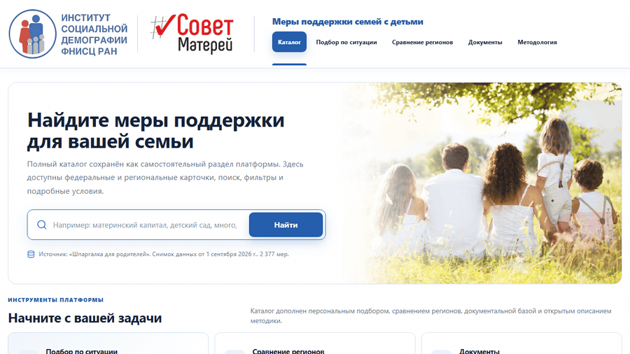
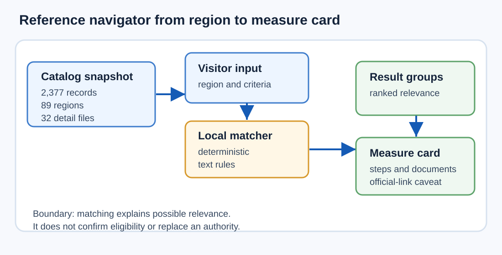
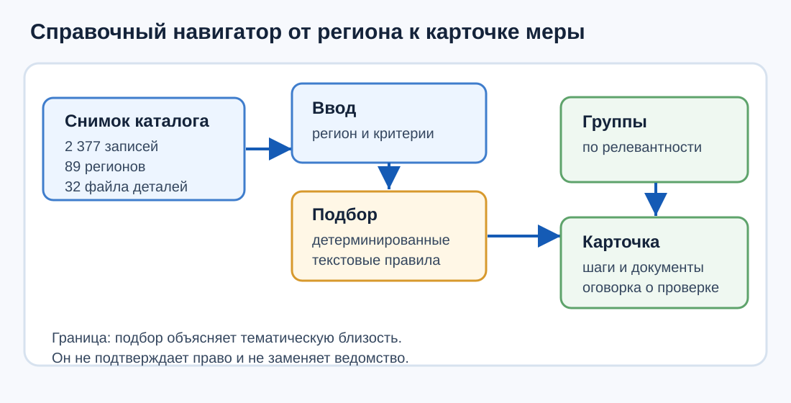

# Family Support Catalog

[English](#english) | [Русский](#русский)

Live site: [https://arseniy24rus.github.io/family-support/](https://arseniy24rus.github.io/family-support/)

<a id="english"></a>
## English


*The application UI is Russian-only; captions and explanations in this README are bilingual.*



### Purpose

Family Support Catalog is a static information platform for navigating support measures for families with children. It was prepared for the Institute of Social Demography of FCTAS RAS and the Council of Mothers context, and it is aimed at parents, researchers, editors, and public-policy readers who need a transparent catalog rather than a private account. The platform does not register users, does not create a server-side family profile, and does not make a legal eligibility decision. Its central promise is narrower and safer: help a visitor find relevant federal and regional cards, understand why a card appeared, and see which conditions must be checked with official services, an authority, or an MFC.

### Workflow

A typical user scenario starts on the catalog page. The visitor chooses a region, searches for terms such as a large family or kindergarten, and opens a card when they need the order of application. A second path uses [`site/situations.html`](site/situations.html): the visitor selects a region, life situation, and clarifying criteria. The deterministic matcher in [`site/lib/life-situation-engine.js`](site/lib/life-situation-engine.js) filters out other regions, compares the card title, summary, benefit type, category, and optional query terms, then groups results as most relevant, condition-dependent, or related. In the README demo, the flow is Moscow plus large-family context plus a low-income criterion and a “детский сад” query, followed by opening a measure card. The measure-card dialog keeps the reference-only warning visible: even when there is an exact official link, the user must verify the current edition, eligibility terms, and application route.

### Data/methodology

The current local data snapshot contains 2,377 measure cards, 89 regions, 32 detail files, and 55 exact official links in metadata. The snapshot timestamp in [`site/data/meta.json`](site/data/meta.json) is 2026-09-01T05:15:47.856Z. The main catalog loads short cards from [`site/data/measures.json`](site/data/measures.json), loads detailed conditions from [`site/data/details`](site/data/details) only when needed, and visualizes regional coverage through [`site/data/ru-regions.geojson`](site/data/ru-regions.geojson). The public methodology page and repository docs repeatedly state the same boundary: absence of a regional card means absence from the current source, not absence of support in that region.



### Architecture

The project is intentionally static. [`site/index.html`](site/index.html) is the full catalog, [`site/situations.html`](site/situations.html) is the local life-situation matcher, [`site/compare.html`](site/compare.html) compares the structure of regional catalog records and policy-document coverage, [`site/documents.html`](site/documents.html) exposes the strategy/document library with lazy file loading, and [`site/methodology.html`](site/methodology.html) explains sources, privacy, limitations, and corrections. Shared logic lives in [`site/lib`](site/lib). The matching and comparison methods are described in [`docs/platform-methodology.md`](docs/platform-methodology.md), the proposed structured next-generation data model is in [`docs/data-model-v3.md`](docs/data-model-v3.md), and editorial correction expectations are in [`docs/editorial-policy.md`](docs/editorial-policy.md). The comparison 2.0 methodology is separate in [`docs/comparison-v2-methodology.md`](docs/comparison-v2-methodology.md) because it deals with descriptive regional structure and document corpora rather than personal eligibility.

### Limits

The limitations are part of the product, not fine print. The situation matcher is text-based and deterministic; it does not know a family’s full legal status, income period, property rules, residence duration, deadline, or current agency practice unless those facts are represented in the source card. Regional comparison is descriptive: it is not normalized by population, number of children, budgets, prices, recipients, or service capacity, so it is not a ranking of generosity or effectiveness. Favorites are stored in browser `localStorage`, and the situation questionnaire processes answers locally; URLs intentionally include only region and situation, not sensitive free text or selected facts.

Licensing is unresolved by design. [`docs/licensing-todo.md`](docs/licensing-todo.md) says the owner must separately decide rights for program code, authored text, the structured dataset, partner materials, logos, and document corpora before presenting the project as open data or open source. Until that is done, public repository access should not be read as a blanket license for reuse.

### Local usage

Local development requires Node.js 22 or newer:

```bash
npm ci
npm run serve
```

After `npm run serve`, open:

```text
http://localhost:8080/index.html
http://localhost:8080/situations.html
http://localhost:8080/compare.html
http://localhost:8080/documents.html
http://localhost:8080/methodology.html
```

Do not open the HTML through `file://`; browsers will block local JSON loading.

<details>
<summary>Full checks and document corpus commands</summary>

```bash
npm run check
npm test
npx playwright install --with-deps chromium
npm run test:e2e
npm run documents:sync -- --force
python3 scripts/profile-strategy-texts.py
npm run documents:verify
```

[`/.github/workflows/update-and-deploy.yml`](.github/workflows/update-and-deploy.yml) runs unit tests, project checks, optional data refresh, Playwright e2e, and then publishes `site/` through GitHub Pages. [`/.github/workflows/sync-family-documents.yml`](.github/workflows/sync-family-documents.yml) synchronizes and verifies the full-text document corpus when invoked.

</details>

<details>
<summary>Preserved operational notes</summary>

- The catalog update flow is `npm run update`, then `npm run check`, `npm test`, and `npm run test:e2e`.
- `CHECK_EXTERNAL_LINKS=1` is reserved for publication or scheduled checks where external-link verification is expected.
- The full-text document workflow must not commit a partial corpus; checks, tests, and e2e should pass first.
- Corrections should go through issue links generated from measure cards and should not include personal data.
- A technically successful parse is not legal verification of every amount, criterion, or deadline.

</details>

<a id="русский"></a>
## Русский


*Интерфейс приложения русскоязычный; подписи и пояснения в README двуязычные.*


### Назначение

Family Support Catalog — статическая информационная платформа для навигации по мерам поддержки семей с детьми. Она подготовлена для контекста Института социальной демографии ФНИСЦ РАН и Совета матерей и рассчитана на родителей, исследователей, редакторов и читателей в сфере социальной политики, которым нужен прозрачный каталог без личного кабинета. Платформа не регистрирует пользователей, не создаёт серверный профиль семьи и не принимает юридически значимое решение о праве на выплату или услугу. Её задача: помочь найти релевантные федеральные и региональные карточки, объяснить причину попадания в результат и показать условия, которые нужно проверить в официальном сервисе, ведомстве или МФЦ.

### Рабочий сценарий

Типовой сценарий начинается с каталога. Пользователь выбирает регион, вводит запрос вроде «многодетная семья» или «детский сад» и открывает карточку, когда нужен порядок оформления. Второй маршрут — [`site/situations.html`](site/situations.html): пользователь выбирает регион, жизненную ситуацию и уточняющие обстоятельства. Детерминированный подборщик в [`site/lib/life-situation-engine.js`](site/lib/life-situation-engine.js) исключает чужие регионы, сопоставляет название, аннотацию, характер поддержки, категорию и дополнительные слова, а затем группирует результат как наиболее релевантный, требующий проверки условий или связанный. В README-демо выбран пример: Москва, многодетная семья, признак низкого дохода и запрос «детский сад», после чего открывается подробная карточка. В диалоге карточки сохраняется справочная оговорка: даже точная официальная ссылка требует проверки актуальной редакции, критериев и маршрута обращения.

### Данные и методология

Текущий локальный снимок содержит 2 377 карточек, 89 регионов, 32 файла подробностей и 55 точных официальных ссылок в метаданных. Дата снимка в [`site/data/meta.json`](site/data/meta.json) — 2026-09-01T05:15:47.856Z. Основной каталог загружает краткие записи из [`site/data/measures.json`](site/data/measures.json), подробные условия из [`site/data/details`](site/data/details) только по запросу пользователя и карту регионального покрытия из [`site/data/ru-regions.geojson`](site/data/ru-regions.geojson). Публичная методология и документы репозитория повторяют важную границу: если по региону нет карточки, это означает отсутствие сведений в текущем источнике, а не отсутствие поддержки в субъекте.



### Архитектура

Проект намеренно статический. [`site/index.html`](site/index.html) — полный каталог, [`site/situations.html`](site/situations.html) — локальный подбор по жизненной ситуации, [`site/compare.html`](site/compare.html) — сравнение структуры региональных записей и покрытия документального корпуса, [`site/documents.html`](site/documents.html) — библиотека стратегий и программ с ленивой загрузкой файлов, [`site/methodology.html`](site/methodology.html) — источники, приватность, ограничения и исправления. Общая логика находится в [`site/lib`](site/lib). Методика подбора и сравнения описана в [`docs/platform-methodology.md`](docs/platform-methodology.md), проектная схема следующего поколения — в [`docs/data-model-v3.md`](docs/data-model-v3.md), редакционная процедура — в [`docs/editorial-policy.md`](docs/editorial-policy.md). Методология сравнения 2.0 вынесена в [`docs/comparison-v2-methodology.md`](docs/comparison-v2-methodology.md), потому что она описывает структуру карточек и документов, а не персональное право семьи.

### Ограничения

Ограничения являются частью продукта, а не мелким шрифтом. Подбор по ситуации основан на тексте и детерминированных правилах; он не знает полный правовой статус семьи, расчётный период доходов, имущественные ограничения, срок проживания, дедлайн обращения или практику ведомства, если эти сведения не представлены в карточке. Межрегиональное сравнение описательное: оно не нормируется на население, число детей, бюджет, цены, получателей или мощность услуг, поэтому не является рейтингом щедрости или эффективности. Избранное хранится в `localStorage`, а анкета подбора обрабатывается в браузере; в публичную ссылку намеренно попадают только регион и ситуация, без чувствительного свободного текста и уточняющих признаков.

Лицензирование намеренно не решено автоматически. [`docs/licensing-todo.md`](docs/licensing-todo.md) фиксирует, что владелец должен отдельно определить права на код, авторские тексты, структурированный массив, материалы партнёра, логотипы и документальный корпус перед тем, как называть проект open data или open source. До такого решения публичность репозитория не является общей лицензией на повторное использование.

### Локальный запуск

Для локальной разработки нужен Node.js 22 или новее:

```bash
npm ci
npm run serve
```

После `npm run serve` доступны:

```text
http://localhost:8080/index.html
http://localhost:8080/situations.html
http://localhost:8080/compare.html
http://localhost:8080/documents.html
http://localhost:8080/methodology.html
```

Открывать HTML через `file://` не следует: браузер заблокирует загрузку локальных JSON.

<details>
<summary>Полные проверки и команды документального корпуса</summary>

```bash
npm run check
npm test
npx playwright install --with-deps chromium
npm run test:e2e
npm run documents:sync -- --force
python3 scripts/profile-strategy-texts.py
npm run documents:verify
```

Workflow [`/.github/workflows/update-and-deploy.yml`](.github/workflows/update-and-deploy.yml) запускает модульные тесты, проверки проекта, опциональное обновление данных, Playwright e2e и публикует `site/` через GitHub Pages. Workflow [`/.github/workflows/sync-family-documents.yml`](.github/workflows/sync-family-documents.yml) синхронизирует и проверяет полнотекстовый корпус документов.

</details>

<details>
<summary>Сохранённые эксплуатационные заметки</summary>

- Обновление каталога: `npm run update`, затем `npm run check`, `npm test` и `npm run test:e2e`.
- `CHECK_EXTERNAL_LINKS=1` используйте для публикационных или плановых проверок, где ожидается проверка внешних ссылок.
- Workflow полнотекстовых документов не должен коммитить частичный корпус; сначала должны пройти проверки, тесты и браузерные e2e.
- Исправления лучше оформлять через issue-ссылки из карточек и без персональных данных.
- Технически успешный парсинг не является юридической проверкой каждой суммы, критерия или срока.

</details>
